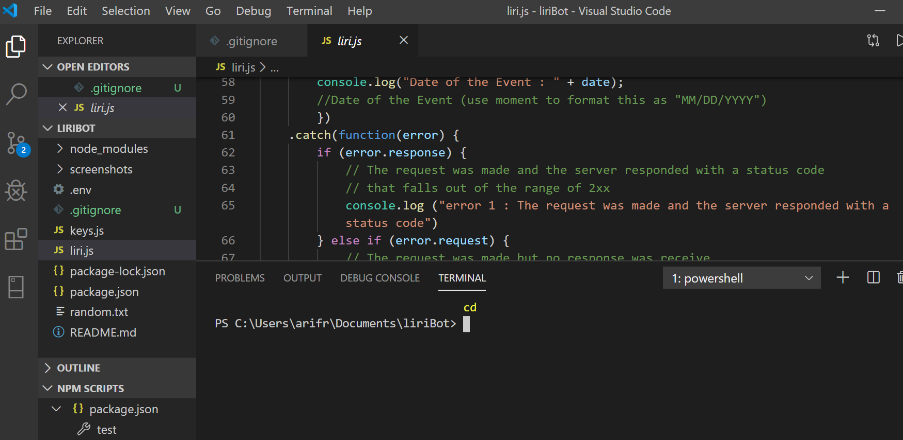
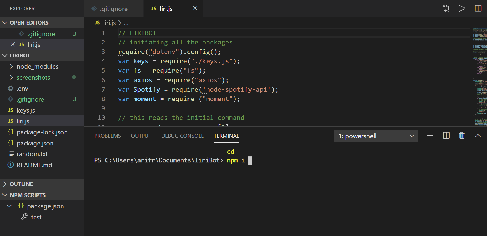
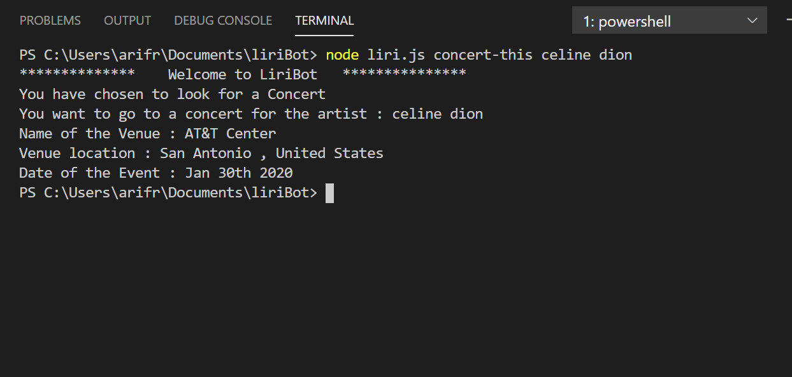
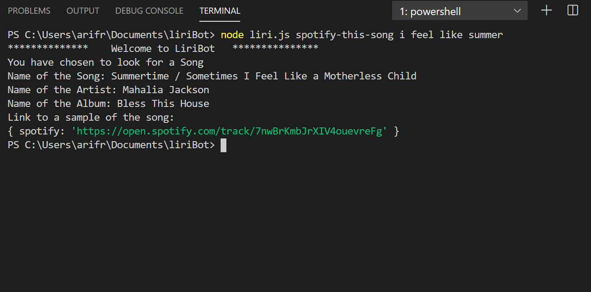
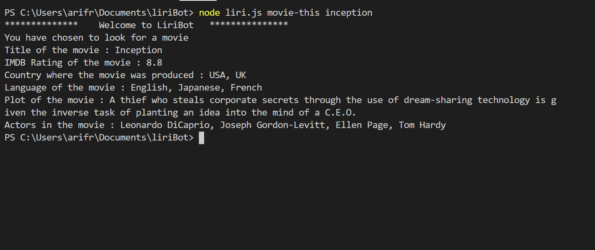

# liriBot

## Purpose 
This project is called LiriBot. It will take in 3 commands to either search for a movie, a song or a concert by an artist of your choice. it will run on GitBash or on a terminal on visual studio.

## Background on the code
The application is written in JavaScript. The first are declaring all the variables and required files. Then we have a series of functions to decipher input and provide the necessary output.

## Instruction
To Start, direct your terminal to the liriBot folder. Key in 'npm i', so all necessary JS files are downloaded.

**Once completed**, you are ready to run this program. Key in "node liri.js " followed by one of the 4 commands, a space and then your search query:
- if you want to search for a concert, type, "concert-this"
    *example: node liri.js concert-this shawn mendes*
    
    
    
- if you want to search for a song, type, "spotify-this-song"
    *example: node liri.js spotify-this-song i feel like summer*
    
    
    
- if you want to search for a movie, type, "movie-this"
    *example: node liri.js movie this inception*
    
    
    
    
- if you want your instructions from the text file named random.txt, type, "do-what-it-says"
    *example: node liri.js do-what-it-says*
    **notes on writing instructions on random.txt:** please key in your instruction as you would in your terminal, ie. concert-this / spotify-this-song /movie-this , followed by a comma and then your search query
        *example: concert-this, cher*

    
        

Screen shots included in the screen shots 

